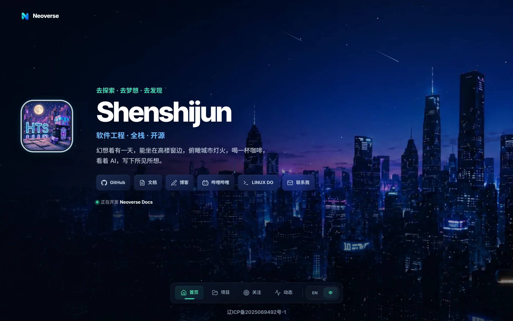

<div align="center">

# Neoverse

Shenshijun's personal space for software engineering, open source, and agentic development.

<p align="center">
  <a href="https://nuxt.com"></a>
  <a href="https://vuejs.org"></a>
  <a href="https://www.typescriptlang.org"></a>
  <a href="https://tailwindcss.com"></a>
  <a href="https://bun.sh"></a>
</p>

</div>

## About

Neoverse is Shenshijun's personal homepage and a small Nuxt portfolio with a persistent bottom dock, responsive glass UI, bilingual content, and a shared city background for coordinated route transitions. Missing external data is shown as unavailable; the site never fabricates activity.

## Preview

> Dark glass-morphism · shared city skyline · bottom dock — 全站深色主题，基于 `app/assets/css/tokens.css` 设计令牌与 `glass-card` 毛玻璃材质，城市背景在路由间协同缩放。

<p align="center">
  
  <br />
  <em>Home <code>/</code> — Cosmos 城市动效、磨砂玻璃快捷入口与底部 Dock（<code>HomeSection.vue</code> + <code>CityBackdrop.vue</code>）</em>
</p>

## Routes

| Route | Purpose |
| --- | --- |
| `/` | Profile, links, and animated city scene |
| `/projects` | Selected project previews |
| `/focus` | Current engineering interests |
| `/pulse` | GitHub contributions, commits, and activity |
| `/design` | Hidden, `noindex` design-system reference |

## Stack

| Layer | Choice |
| --- | --- |
| Framework | [Nuxt](https://nuxt.com), Vue, and Nitro |
| Language | TypeScript with strict type checking |
| Styling | [Tailwind CSS](https://tailwindcss.com) via `@tailwindcss/vite` |
| Fonts | Inter Variable via `@fontsource-variable/inter` |
| Icons | Iconify via `unplugin-icons` (Lucide and Simple Icons) |
| Localization | [`@nuxtjs/i18n`](https://i18n.nuxtjs.org) — English and Simplified Chinese |
| Tooling | [Biome](https://biomejs.dev) and [Bun](https://bun.sh) |

## Development

Requires [Bun](https://bun.sh) to install and run the project.

```bash
bun install
bun run dev
```

Open `http://localhost:3000`.

### Optional environment

Copy `.env.example` to `.env` and set `NUXT_GITHUB_TOKEN` to enable the server-side GitHub GraphQL data path. The Pulse page still works without a token using its public-data fallback.

```dotenv
NUXT_GITHUB_TOKEN=
```

## Commands

| Command | Description |
| --- | --- |
| `bun run dev` | Start the development server |
| `bun run build` | Build for production |
| `bun run preview` | Preview the production build |
| `bun run generate` | Generate a static site |
| `bun run typecheck` | Run Nuxt type checking |
| `bun run check` | Format, lint, and type-check |
| `bun run test:fouc` | Check critical SSR shell styles; requires the dev server |

## Structure

```text
app/                 # Pages, components, composables, and global styles
i18n/                # English and Simplified Chinese locale files
server/              # Cached GitHub and project-preview endpoints
shared/              # Shared constants and TypeScript contracts
public/              # Static assets
scripts/             # Critical-shell verification
```

## License

[Star And Thank Author License 2.0](LICENSE)
