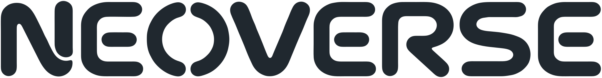
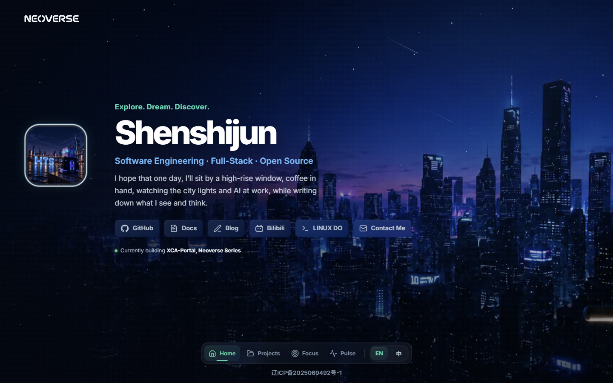

<div align="center">

<h1>
  <picture>
    <source media="(prefers-color-scheme: dark)" srcset="public/images/neoverse-white.svg">
    <source media="(prefers-color-scheme: light)" srcset="public/images/neoverse.svg">
    
  </picture>
</h1>

Neoverse is Shenshijun's portfolio of software projects and open-source work, with a focus on software engineering and AI-assisted development.

<p align="center">
  <a href="https://nuxt.com"></a>
  <a href="https://vuejs.org"></a>
  <a href="https://www.typescriptlang.org"></a>
  <a href="https://tailwindcss.com"></a>
  <a href="https://bun.sh"></a>
</p>

</div>

## About

Neoverse is my Nuxt portfolio for the projects I build and the engineering topics I'm focused on. It brings together a responsive glass interface, English and Simplified Chinese content, a persistent bottom dock, and a city scene that carries across page transitions. When external data isn't available, the site says so instead of making up activity.

## Preview

An animated city scene carries across pages, while frosted-glass cards and a bottom dock keep the main sections within easy reach. The dark theme uses shared design tokens and the `glass-elevated` material.

<p align="center">
  
  <br />
  <em>Home — animated city backdrop, glass quick links, and the bottom dock.</em>
</p>

## Routes

| Route | Purpose |
| --- | --- |
| `/` | My profile, selected links, and the animated city scene |
| `/projects` | A selection of projects and previews |
| `/focus` | The engineering topics I'm focused on |
| `/pulse` | GitHub contributions, recent commits, and activity |
| `/design` | Design-system reference, kept out of the main navigation and search index |

## Stack

| Layer | Choice |
| --- | --- |
| Framework | [Nuxt](https://nuxt.com), Vue, and Nitro |
| Language | TypeScript with strict type checking |
| Styling | [Tailwind CSS](https://tailwindcss.com) via `@tailwindcss/vite` |
| Design system | [Neoverse UI 0.2.0](https://github.com/SSJ-ZYJ/Neoverse-UI) — shared tokens, Tailwind, Material and Motion systems, Vue/React adapters, and Glass runtime. See its [README for package details and the Design Lab](https://github.com/SSJ-ZYJ/Neoverse-UI#readme). |
| Fonts | Inter Variable via `@fontsource-variable/inter` |
| Icons | Iconify via `unplugin-icons` (Lucide and Simple Icons) |
| Localization | [`@nuxtjs/i18n`](https://i18n.nuxtjs.org) — English and Simplified Chinese |
| Tooling | [Biome](https://biomejs.dev) and [Bun](https://bun.sh) |

## Development

Install [Bun](https://bun.sh), then run:

```bash
bun install
bun run dev
```

Visit `http://localhost:3000` in your browser.

### Optional environment

Pulse can use GitHub's GraphQL API for contribution data when `NUXT_GITHUB_TOKEN` is set. To enable it, copy `.env.example` to `.env` and add your token. Without one, Pulse falls back to public GitHub data.

```dotenv
NUXT_GITHUB_TOKEN=
```

## Commands

| Command | Description |
| --- | --- |
| `bun run dev` | Start the Nuxt development server |
| `bun run build` | Build the app for production |
| `bun run preview` | Preview the production build locally |
| `bun run generate` | Generate a static site |
| `bun run typecheck` | Run Nuxt's type checker |
| `bun run format` | Format files with Biome and write changes |
| `bun run format:check` | Check formatting without writing changes |
| `bun run lint` | Run Biome checks without applying fixes |
| `bun run lint:fix` | Run Biome checks and write fixes |
| `bun run check:ui-boundary` | Check app source against Neoverse UI boundaries |
| `bun run test:repository-pulse` | Test Pulse aggregation, deduplication, pagination, and incomplete searches |
| `bun run test:fouc` | Check critical fallback styles in SSR HTML; requires a dev server |
| `bun run test:dev` | Smoke-test all routes on a dev server; accepts `NEOVERSE_TEST_URL` |
| `bun run test:ui-css` | Check published UI CSS with the production PostCSS pipeline |
| `bun run check` | Run Biome with autofixes, UI boundary and CSS checks, then Nuxt typecheck |

## Structure

```text
app/
  app.vue
  assets/css/                 # Design tokens, global styles, and dock styles
  components/                 # Shared shell plus home, focus, pulse, project, navigation, and design views
  composables/                # Navigation, transitions, city motion, and data helpers
  pages/                      # Home, projects, focus, pulse, and design routes
i18n/
  i18n.config.ts
  locales/                    # English and Simplified Chinese
server/
  api/github/pulse.get.ts
  api/projects/previews.get.ts
  utils/                      # GitHub Pulse and project-preview helpers
shared/
  constants.ts                # Navigation and shared constants
  types/
    github.ts                 # GitHub Pulse contracts
    projects.ts               # Project preview contracts
public/
  fonts/
  images/
scripts/                       # Formatting, boundary, CSS, Pulse, and SSR checks
docs/screenshots/              # README preview image
```

## License

[Star And Thank Author License 2.0](LICENSE)
